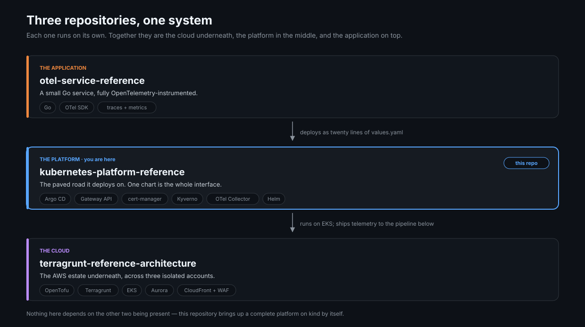
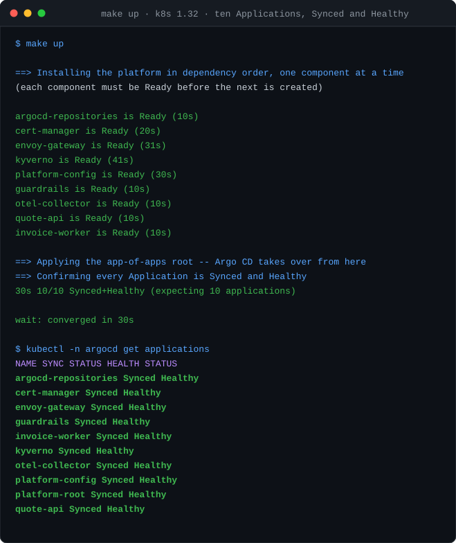
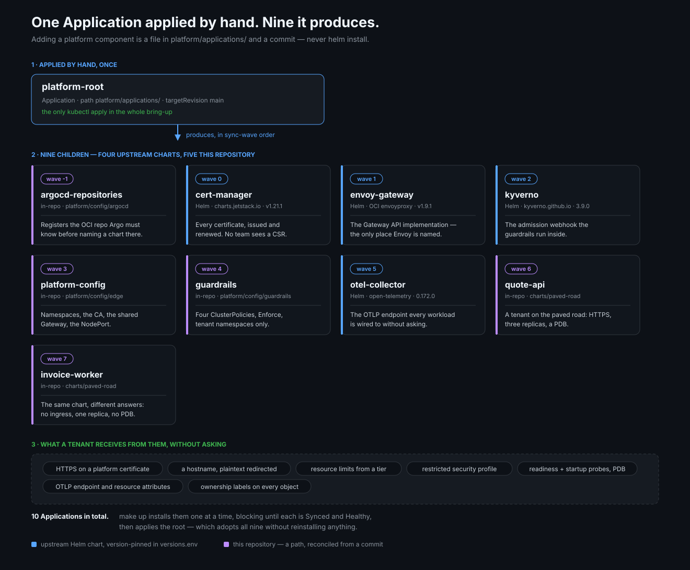
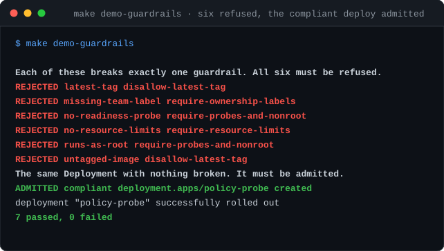
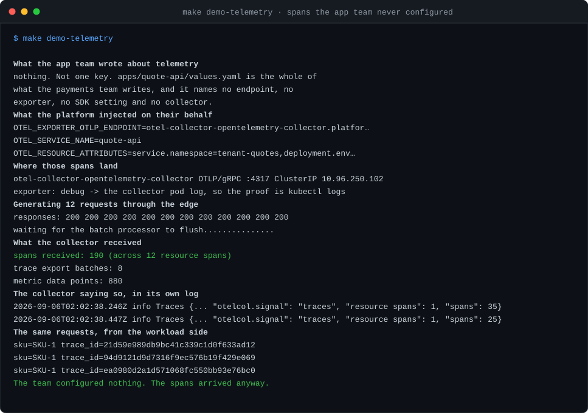
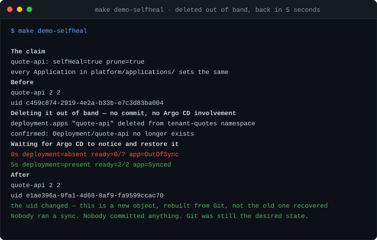

# Kubernetes Platform Reference

[](https://github.com/bezilla/kubernetes-platform-reference/actions/workflows/ci.yml)
[](LICENSE)


**A complete Kubernetes platform you can run on your laptop in five minutes.**

An app team writes one twenty-line file. They get a service that is deployed,
routable, on HTTPS, policy-checked and sending telemetry — without writing a
Deployment, a Certificate, an HTTPRoute, a security context or a single resource
number.

It is built from **Argo CD**, **Gateway API**, **cert-manager**, **Kyverno**,
**Helm** and **OpenTelemetry**, on a local **kind** cluster. Nothing is faked and
nothing is stubbed.

It is meant to be read as much as run. Every non-obvious decision is written
down in [DESIGN.md](DESIGN.md), along with every bug that changed how this is
tested — including the ones that were embarrassing.

---

## Part of a set



*The cloud underneath, the platform in the middle, the application on top. Each
repository runs on its own — this one brings up a complete platform on kind with
neither of the others present.*

- **[terragrunt-reference-architecture](https://github.com/bezilla/terragrunt-reference-architecture)** —
  the AWS estate this would run on. EKS, Aurora, a CloudFront/WAF edge, three
  isolated accounts. The `platform.internal/team` labels the guardrails enforce
  here are what its cost attribution keys on.
- **[otel-service-reference](https://github.com/bezilla/otel-service-reference)** —
  the workload that deploys onto it. **You do not need it.** With a checkout at
  `../otel-service-reference`, `make up` builds the real instrumented service.
  Without one it builds the placeholder in `bootstrap/fallback-workload` — a
  pinned nginx with one config file, which serves the same `/healthz` the chart
  probes, on the same ports, as the same non-root user. The paved road, the
  edge, the certificate and the guardrails are all still demonstrated.
  **What is lost is the telemetry, and only that:** the placeholder speaks no
  OTLP, so `make demo-telemetry` reports zero spans and says which of the two
  reasons it is. CI takes this path on every run, because it is the path a
  stranger cloning this repository takes.

---

## Try it

Three commands. No cloud account, no credentials, no sibling repositories.

```bash
git clone https://github.com/bezilla/kubernetes-platform-reference
cd kubernetes-platform-reference

make init     # installs the pre-push gate
make up       # builds the entire platform — about 5 minutes
make demo     # the six proofs below
```



`make up` creates the cluster, installs Argo CD, starts an in-cluster Git
server, builds the workload image, publishes the repository to that server,
installs nine components **one at a time**, and blocks until all ten
Applications are Synced and Healthy. It exits non-zero if anything is not.

| | |
|---|---|
| Time to ten Applications Synced and Healthy | **~5 minutes** on 8 cores |
| Nine components, installed serially | **~3 minutes** |
| `kube-controller-manager` / `kube-scheduler` restarts | **0** |
| Offline policy suite | **42 tests, 0 excluded** |
| Live admission demo | **6 refused, 1 admitted** |
| Telemetry proof | **65 spans**, from a workload configured for none |
| Deployment deleted out of band | **restored in 5s**, no sync run |
| Kubernetes versions the CI matrix targets | **1.32, 1.33, 1.34** — see the note below |
| In-place upgrade from the previous chart versions | **converged, then rolled back** in CI |
| Environments rendered and guardrail-checked | **3 × 2 tenants, 21 assertions** |

> **What has actually run, and where.** The captures above are real output from
> an 8-core machine. The bring-up has run and passed on all three matrix targets
> — Kubernetes 1.32, 1.33 and 1.34 — on run `34167675924`, and the in-place
> upgrade and its rollback re-point ran and passed on that same run. Numbers
> without a qualifier are from repeated local runs.
>
> **The cluster jobs run on GitHub's standard `ubuntu-latest` runner, and the
> margin is zero.** Read from that run's log, identically on all three legs:
> Docker reported `NCPU=4` and 15988 MiB, against `MIN_CPUS=4` and
> `MIN_MEMORY_MIB=5120`, and the workflow's own comparison step printed
> `cpu margin : 0 core(s) over MIN_CPUS`. A runner one core smaller would be
> refused rather than slow. `RECOMMENDED_CPUS` is 8 and is never met there, so
> `up.sh` prints its under-recommended notice on every CI run — that notice is
> correct, and `versions.env` is not edited to silence it.
>
> **This corrects an earlier claim in this file.** It said these jobs could not
> run on free runners because Docker offered 2 CPUs and 7938 MiB. That was
> asserted and never verified, and both figures are wrong; the numbers above are
> read from the run log. Why the runner offers four cores is not asserted here,
> because the log says what it offers and not why.
>
> **What this means if you are running it: nothing.** `make up` works on any
> machine that meets the floor, which is most laptops — it is measured above at
> about five minutes on eight cores.

---

## What you get



*One reconciler and one hand-applied Application. `platform-root` produces the
other nine in sync-wave order — four from upstream Helm charts, five from paths
in this repository. Adding a platform component is a file and a commit, never
`helm install`.*

| Application | Source | Provisions |
|---|---|---|
| **argocd-repositories** | this repo · `platform/config/argocd` | The OCI repository registration Argo CD needs before an Application may name a chart there |
| **cert-manager** | Helm · jetstack `v1.21.1` | Every certificate on the cluster, issued and renewed. No team ever sees a CSR |
| **envoy-gateway** | Helm · OCI envoyproxy `v1.9.1` | The Gateway API implementation — the only place Envoy is named |
| **kyverno** | Helm · kyverno.github.io `3.9.0` | The admission webhook the guardrails run inside |
| **platform-config** | this repo · `platform/config/edge` | Namespaces, the root CA, the shared Gateway, the NodePort that publishes it |
| **guardrails** | this repo · `platform/config/guardrails` | Four `ClusterPolicy` objects in `Enforce`, scoped to tenant namespaces |
| **otel-collector** | Helm · open-telemetry `0.172.0` | The OTLP endpoint every workload is wired to without asking |
| **quote-api** | this repo · `charts/paved-road` | A tenant on the paved road: published on HTTPS, three replicas, a PodDisruptionBudget |
| **invoice-worker** | this repo · `charts/paved-road` | A second tenant, same chart, different answers: no ingress, one replica, no PDB |
| **platform-root** | this repo · `platform/applications` | The app-of-apps root — the only `kubectl apply` in the bring-up |

Every version is pinned in [`versions.env`](versions.env). The manifests cannot
source a shell file, so each carries its version literally —
`make check-versions` fails if the two ever disagree, and it runs in CI.

### Guardrails, telemetry and self-healing, proved



Six violations refused, each naming the rule that caught it — and the same
Deployment with nothing broken admitted. Both directions, always, because a
policy that matches everything and a policy that matches nothing look identical
if you only check one.



The team's values file names no endpoint, no exporter and no collector. The
spans arrive anyway.



Ten Applications set `selfHeal: true`. This deletes a Deployment out of band —
no commit, no sync command, nothing nudged — and Argo CD puts it back. The uid
changes, which is how you know it was rebuilt from Git rather than recovered.

---

## The decisions, and the bugs that changed them

The most useful file here is [DESIGN.md](DESIGN.md). It records what was
rejected and why, and every defect that changed how this repository is tested —
including the ones that make the author look bad, because those are the ones
worth reading.

**A guardrail in `Enforce` that admitted every `:latest` image for a day.** The
pattern used a `|` alternation operator Kyverno does not have, so the whole
string parsed as one literal wildcard matching everything. Reading the YAML
produced the bug. Deploying a `:latest` image found it in seconds. That is why
both guardrail suites now assert that compliant resources *pass* as well as that
violations fail.

**A policy suite that reported 42 passing tests while evaluating nothing.**
Every result was marked `Excluded`: the policies are scoped by
`namespaceSelector`, and offline there was no cluster to read namespace labels
from. A suite that cannot run its own rules is the same false confidence as the
bug it was written to catch, wearing a greener colour.

**Sync waves that looked like ordering and were not.** Waves stagger when child
Application *objects* are created. They do not stop five Helm charts unpacking
at once, which drove an 8-core node to ~1900% CPU until `etcd` read latency went
from 100ms to 1.5s and both the controller manager and the scheduler lost leader
election. The fix was to serialize outside Argo CD and block on each component.

**A history scan that returned zero because it never ran.** `git grep` does not
use the system regex engine: given a pattern it cannot honour it matches
nothing, prints nothing, and exits 0. It was caught only because an email sweep
reported zero against history while the same regex found ten in the checkout.
Every gate here now calibrates its scanner against a known-positive *and* a
known-negative before trusting a result.

The thread running through all four: **a zero is not evidence.** It is either an
absence or a broken instrument, and those look identical in a terminal.

---

## Upgrades, and how rollback is tested

`make upgrade-test` runs three phases against one cluster: install the
**previous** pinned chart versions, upgrade in place to the current ones, then
**roll back**. The reasoning is in [DESIGN.md](DESIGN.md); the shape is this.

**Rollback is an Argo CD re-point, not `helm rollback`.** `publish.sh`
force-publishes any revision into the in-cluster mirror as `main`, and every
Application pins `targetRevision: main`, so rolling back means republishing the
older revision under that name and letting Argo CD converge — including pruning
whatever the newer charts added. `helm rollback` was rejected rather than
overlooked: every component is owned by an Application with `selfHeal` and
`prune`, so a Helm rollback would be reverted within seconds. That does not
contradict the test, it contradicts the architecture.

**At the current pins this proves the mechanism and nothing more, and it says
so.** The static report finds no compatibility hazard present to survive:
measured across the four pinned components, **0** CRD storage-version moves,
**0** served-version removals, and **0** resource-set differences across **164**
rendered resources. So a green proves the root rewrites its children backward
and Argo CD converges unattended. It cannot prove rollback is safe in general,
because at these pins there is nothing here for it to be unsafe about.

**The static half answers compatibility without a cluster.** `make pin-delta`
compares the two chart sets in about a minute and runs six checks:

| Check | What it catches |
|---|---|
| storage version moved | objects are persisted at the storage version, so the older CRD cannot read what the newer one wrote — rollback is impossible, not slow |
| served version removed | a version something still submits stops being accepted |
| resource set changed | an object the newer chart adds or drops, which is what a rollback would have to prune or restore |
| CRD field removed | a field the older chart's schema no longer knows |
| CRD field added | a field the newer chart added: set it, roll back, and the API server **silently prunes** it — not rejected, and Argo CD still reports Synced |
| constraint tightened | validation that moved, so an object valid before the bump is refused after it — the only one that breaks *forward* |

Its verdict on the first check gates the live leg: if a storage version moved,
the rollback is skipped with a warning rather than spending eleven minutes
discovering what a one-minute static report already knew.

**`make schema-check`** is the other cluster-free half: every rendered manifest
validated against each Kubernetes version in the matrix, which catches an API
removed in a version still covered. Also about ten seconds, also no cluster.

---

## How an app team deploys

This is the entire interface. There is no Deployment to write, no Service, no
HTTPRoute, no Certificate, no security context, and no resource arithmetic.

`apps/quote-api/values.yaml`:

```yaml
owner:
  team: payments                  # required — becomes the labels that page you
  contact: payments@example.com   # required
  description: Quote pricing API. Instrumented with OpenTelemetry end to end.

image:
  repository: platform.local/quote-api
  tag: "0.1.0"                    # `latest` is rejected, twice: by the schema
                                  # and again at admission
replicas: 3

port: 8080
resources:
  tier: nano                      # nano | small | medium | large

health:
  path: /healthz

ingress:
  enabled: true
  subdomain: quote-api            # -> https://quote-api.apps.platform.test

env:
  API_ADDR: ":8080"
```

Commit it. Argo CD applies it. **That is the deploy** — there is no pipeline
step and no `kubectl`.

### What you got without asking for it

| | |
|---|---|
| **HTTPS** | A cert-manager certificate on a shared Gateway. You never see an issuer, a CSR or a renewal. |
| **A hostname** | `<subdomain>.apps.platform.test`, with plaintext redirected to HTTPS. |
| **Resource limits** | From `tier`, not from you guessing millicores. The platform can retune every service on the cluster by editing one map. |
| **A restricted security profile** | Non-root, read-only root filesystem, all capabilities dropped, seccomp, no mounted service-account token. |
| **Zero-downtime deploys** | A readiness probe, a startup probe, `maxUnavailable: 0`, and a PodDisruptionBudget when you run more than one replica. |
| **Telemetry** | `OTEL_*` pointing at the platform collector, plus resource attributes naming your team and environment. |
| **Ownership labels** | Derived from `owner`, on every object. This is what answers "who do I page" at 03:00. |

### Why `tier` instead of numbers

Because teams should not have to reason about millicores, and because a
platform that lets thirty teams each invent their own numbers cannot ever retune
anything. `resources.custom` exists for the service that genuinely does not fit,
and using it is meant to be a conversation rather than a default.

### If you get rejected

Admission control refuses a deploy that misses the road, and it names the rule:

```
resource Deployment/tenant-quotes/quote-api was blocked due to the following policies

require-resource-limits:
  autogen-containers-must-declare-resources: 'validation failure: Every container
  must set resources.requests.cpu, resources.requests.memory and
  resources.limits.memory. The paved-road chart sets these from `resources.tier`'
```

Everything the chart renders already passes all four guardrails. If you are
seeing one of these, you are writing raw YAML — which is allowed, and is exactly
when the backstop is meant to fire.

---

## How the platform is built


**One reconciler.** Argo CD, app-of-apps. DESIGN.md sets out why this is not
split into Flux-for-platform and Argo-for-apps, what that split genuinely buys,
and the write-loop failure mode of two level-triggered engines over overlapping
manifests.

**Gateway API, not Ingress.** The platform owns `GatewayClass` and `Gateway`;
app teams own `HTTPRoute`. Nothing an app team writes names Envoy, so the
implementation can be replaced without touching a tenant namespace. Under
Ingress the equivalent knobs are vendor-specific annotations, which hard-code
your proxy into thirty repositories and fail silently when misspelled.

**The chart is the interface.** `charts/paved-road` is the seam between the
platform and its tenants, and everything it renders satisfies the guardrails by
construction — so a team on the paved road never meets admission control at all.

**Guardrails are enforced, not audited**, and scoped to namespaces carrying
`platform.internal/paved-road: "true"` so they apply to tenants rather than to
the platform's own upstream charts.

| Layout | |
|---|---|
| `bootstrap/` | the two imperative installs, the app-of-apps root, the fallback workload |
| `platform/applications/` | one Argo Application per component |
| `platform/config/edge/` | namespaces, the CA, the Gateway, the NodePort |
| `platform/config/guardrails/` | the four Kyverno policies |
| `charts/paved-road/` | the authored chart — the interface |
| `apps/quote-api/` | one app team's values file |
| `tests/guardrails/` | fixtures for both suites |
| `versions.env` | every pinned version, in one place |

### Onboarding a tenant

Two things: a namespace labelled `platform.internal/paved-road: "true"`, and a
values file. The label is load-bearing in three places at once — the guardrails
select on it, the Gateway's `allowedRoutes` select on it, and it is what an
operator reads to know who owns a namespace. A namespace without it cannot
publish itself through the edge no matter what it writes.

---

## Environments

A team that says nothing about size gets numbers appropriate to where the
service is running. A team that says something wins. `environments/*.yaml` is
layered **under** a team's values file, so it sets defaults rather than ceilings
— ceilings are the guardrails' job, enforced at admission where a values file
cannot out-argue them.

The same tenant, setting only the four required fields, rendered three ways:

| | replicas | cpu request | PodDisruptionBudget | edge timeout |
|---|---|---|---|---|
| **local** | 1 | 200m | no | 60s |
| **staging** | 2 | 500m | yes | 30s |
| **production** | 3 | 1000m | yes | 15s |

What does *not* change between them is the security posture: the same four
guardrails, the same restricted profile, the same mandatory ownership labels. An
environment that relaxes policy is not a rehearsal, it is a different play.

`make check-environments` renders every environment for every tenant, validates
the output, checks it against all four guardrails, and asserts the three
environments actually produce different shapes — an environment layer that
renders identically everywhere is decoration, and would otherwise pass in
silence. It runs in CI on every commit.

**What this does not claim.** Only `local` is ever installed. There is one kind
cluster, and standing up three would be the stub this repository keeps refusing
to build. The environment files are a rendering contract and that contract is
checked; bringing staging and production up for real needs real infrastructure,
and is [in the roadmap](ROADMAP.md) rather than faked here.

---

## What is deliberately not here

Knowing what not to build is most of the job. Each of these is spoken to in
documentation rather than stubbed, because a `NodePool` that never scales
anything is not a demonstration of Karpenter — it is a claim about Karpenter the
repository cannot back.

| Excluded | Why |
|---|---|
| **Karpenter** | Needs a real cloud account, real instance types and a scheduler under genuine pressure. On one kind node it would have nothing to scale. |
| **KubeCost / OpenCost** | Only meaningful against real billing data. Every number here would be zero or invented, which is worse than absent. |
| **Cluster API** | Solves cluster lifecycle. This repository has one cluster, created by one `kind` command. |
| **A service mesh** | Two services do not need it, it roughly doubles per-pod memory, and the one thing it would show here — traffic splitting — Gateway API already expresses. |
| **Flux alongside Argo** | Not because it is worse. Because two level-triggered reconcilers over overlapping manifests is a write loop, and disjoint ownership needs a boundary a single-cluster platform cannot justify. |

| **Blue/green cluster cutover** | Needs two clusters and a traffic-shifting layer above them. See below — this is a scope statement, not an oversight. |

### In-place upgrades, not blue/green

This platform tests **in-place component upgrades**: the charts move underneath
a running cluster and everything is expected to converge without intervention.
That is a real thing to test and it is what one `kind` cluster can honestly
demonstrate.

It is not the pattern I have run in production. That one is blue/green with
traffic drained at the edge — Route 53 shifting off the cluster, drain, upgrade,
shift back. In that model, upgrading under load is not the problem: the drain
and the cutover are. Proving it needs two clusters and a traffic-shifting layer
in front of them, which is past what `kind` provides, so it is named here rather
than approximated.

So: this repository demonstrates that an in-place upgrade converges and that a
rollback re-point works. It does not demonstrate a zero-downtime cutover, and
nothing here should be read as a claim that it does.

[ROADMAP.md](ROADMAP.md) has what *is* next, in order, with the reasoning.

---

## Requirements, and the detail

`make up` refuses to start if any of this is wrong, and says which. Read it if a
bring-up fails; skip it otherwise.

**Prerequisites**

| | |
|---|---|
| Docker | 4 CPUs and 5120 MiB minimum, 8 CPUs and 8192 MiB recommended. **Not the containerd image store** — see below. |
| [kind](https://kind.sigs.k8s.io) | creates the cluster |
| `docker` on your PATH | the `docker-desktop` cask needs an **interactive** sudo to symlink into `/usr/local/bin`; installed non-interactively it rolls that step back and leaves `docker` off PATH entirely. Run the install from a terminal that can prompt, then check `command -v docker` before going further |
| kubectl, [helm](https://helm.sh), git | |
| [gitleaks](https://github.com/gitleaks/gitleaks) | only for `make init`; the pre-push gate fails closed without it |
| [kubeconform](https://github.com/yannh/kubeconform) | `make lint` and `make check-environments`, which skip manifest validation with a count when it is absent rather than failing, and `make schema-check`, which refuses to run without it |
| [kyverno CLI](https://github.com/kyverno/kyverno) | only for `make policy-test`, which fails closed without it — a policy suite that quietly does not run is how a policy matching everything reaches production |

> **Turn off Docker's containerd image store.** Docker Desktop enables it by
> default and reports its driver as `overlayfs` rather than `overlay2`. Under
> it, a pulled multi-architecture image is stored as an index whose other
> platforms are referenced but never fetched, and `kind load docker-image` —
> which imports with `--all-platforms` — fails on the missing blob with
> `ctr: content digest sha256:...: not found`. It fails minutes in, only for
> images that were pulled rather than built, so it reads as a kind bug and is
> not one. Settings → General → uncheck *Use containerd for pulling and storing
> images*, restart Docker, and confirm `docker system info --format
> '{{.Driver}}'` says `overlay2`. `make up` refuses to start otherwise.
>
> **Give Docker CPU, but do not max its memory.** Cores are what this platform
> runs out of first. Memory is the one people over-allocate: Docker Desktop
> defaults to half of physical RAM, so a 16 GiB machine hands it about 7934 MiB
> — under the recommended figure — while setting the slider to the full 16 GiB
> leaves macOS nothing and gets the kind container evicted mid-run. On 16 GiB,
> 12288 MiB is a good setting; Docker reports back 200–350 MiB less than the
> slider, so verify with `docker system info` rather than trusting the dialog.
>
> **Close other kind clusters first.** Five kind nodes on eight cores starved
> this control plane into a TLS handshake timeout. `make up` warns if it finds
> others running.

```bash
make status   # applications, edge, guardrails, workloads
make argo     # the Argo CD UI, with the admin password
make publish  # mirror your working tree to the in-cluster Git server
make down     # delete the cluster and .work/
```

**Argo CD does not read GitHub.** It reads an in-cluster Git server that
`make publish` mirrors this working tree into. The Applications pin
`targetRevision: main`, so the mirror publishes your checked-out branch under
**`refs/heads/main` on that in-cluster mirror only** — nothing is pushed to
GitHub, and your branch is not renamed. It is what lets the platform be brought
up from a topic branch rather than only from `main`.

**Trusting the certificate.** The platform creates its own CA at install time.
`make demo-https` writes it to `.work/platform-ca.crt` and verifies against it
with `curl --cacert`. To use a browser, import that file. It is generated per
cluster and is worthless anywhere else — but do not add it to a system trust
store and forget about it.

### Testing

```bash
make check          # everything CI runs, no cluster needed
make lint           # chart lint + render + schema + manifest validation
make policy-test    # every guardrail against fixtures, offline
make demo-guardrails  # the same, through live admission control
```

CI defines **eight jobs**, which produce **ten check runs** — the bring-up job
is a matrix and fans out to three legs, one per Kubernetes version. All ten run
and pass on `ubuntu-latest`.

**Only four of the ten gate a merge.** That distinction lives in the branch
protection settings rather than in `ci.yml`, so it cannot be seen by reading the
workflow, and it is the thing that most changes how the table below should be
read: the expensive cluster work is *informational*. It reports; it has never
blocked anything.

| Job | Gates a merge | What it does |
|---|---|---|
| `chart · manifests` | **required** | helm lint, render, values schema, manifest validation, every environment, and `versions.env` against every Application |
| `guardrails` | **required** | the policy suite, both directions |
| `identity` | **required** | the identity, trailer and secrets gate over all history at `fetch-depth: 0`, plus the gate's own self-test |
| `supply chain` | **required** | trivy over the tree and both built images, an SPDX SBOM kept per image |
| `fallback path · bring-up · demo · k8s <ver>` | advisory, 3 legs | the whole platform built and all six demos run, no sibling repository present. Matrix: Kubernetes 1.32, 1.33, 1.34 |
| `upgrade in place` | advisory | installs the *previous* chart versions, upgrades to the pinned ones, then rolls back — see [DESIGN.md](DESIGN.md) |
| `pin delta` | advisory | what a pin bump changed, from two chart tarballs, no cluster, about a minute |
| `schema check` | advisory | every rendered manifest against each Kubernetes version in the matrix, no cluster |

The four required checks are the ones that need no cluster and finish in
roughly a minute. The advisory six depend on external registries and on a schema
host, and a required check that reddens because somebody else's CDN had a bad
minute is a check people learn to click past. `pin delta` and `schema check`
also report by design — `pin delta` exits 1 to mean *there is something to
read*, not *something is broken*.

Every action is pinned by commit SHA. [Renovate](renovate.json5) watches the
upstreams and writes a single dashboard issue — it opens no branches and no pull
requests — and the bring-up and upgrade jobs decide whether a move was safe.

---

## Documents

- **[DESIGN.md](DESIGN.md)** — the decisions, the alternatives rejected, and
  every bug that changed how this is tested. Start here.
- [ROADMAP.md](ROADMAP.md) · [CHANGELOG.md](CHANGELOG.md) · [SECURITY.md](SECURITY.md)
